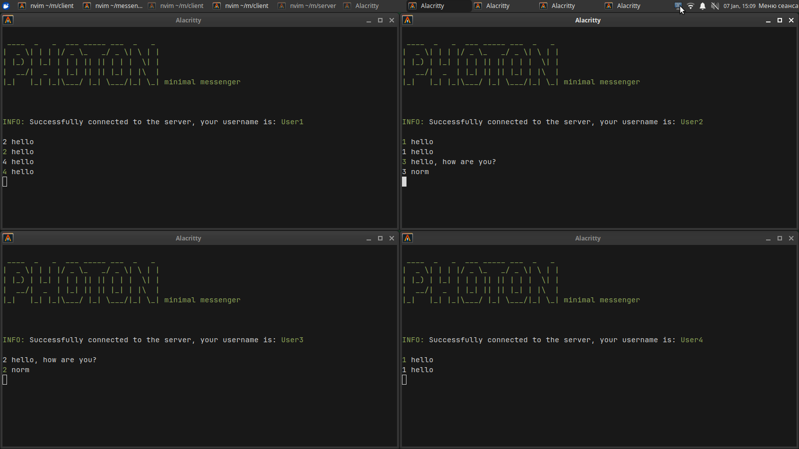

## English

# Minimal Console Messenger in C++ (Boost.Asio)

**Structure:**  
- The server asynchronously receives and sends messages to the intended client.  
- The client is synchronous, split into 2 threads: sending and receiving messages.  

**How it works:**  
- Start the server (can be on the same PC as the client).  
- Start the client and enter the server’s IP address.  
- Messages are typed as `TO WHOM MESSAGE`; currently, the server assigns the ID.  
- Messages appear as `FROM WHO (green)` MESSAGE.  

---

### Screenshot

---

## Русский

# Минимальный консольный мессенджер на C++ (Boost.Asio)

**Структура:**  
- Сервер асинхронно принимает и отправляет сообщения нужному клиенту.  
- Клиент синхронный, разделен на 2 потока: отправка и получение сообщений.  

**Принцип работы:**  
- Запускается сервер (можно на том же ПК, что и клиент).  
- Запускается клиент, вводится IP адрес сервера.  
- Сообщения пишутся в виде `КОМУ СООБЩЕНИЕ`; пока что ID присваивает сервер.  
- Сообщения отображаются в виде `ОТ КОГО (зеленый)` СООБЩЕНИЕ.
